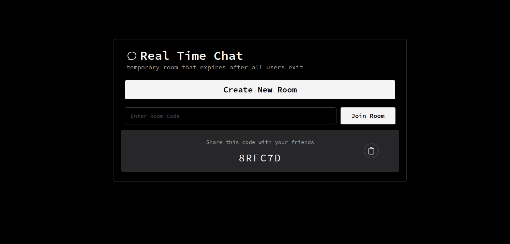

# MERN WebSocket Temporary Chat App

This is a real-time, temporary chat application built using the **MERN stack** (MongoDB, Express.js, React, Node.js) with **WebSocket** integration. It allows multiple users to join a chat room and communicate instantly. Once all users leave the session, the chat history is lost, making it a temporary and private space for conversation.

## 🧠 Key Concept

The app is designed for **ephemeral communication** — a chat session exists only as long as at least one user remains in the room. When everyone leaves, the session and its messages are discarded.

## 🔧 Tech Stack

- **Frontend**: React, Tailwind CSS
- **Backend**: Node.js, Express.js, WebSocket (`ws`)
- **Database**: MongoDB (used only if persistent state is required; this version is in-memory)
- **Communication**: WebSocket protocol for real-time messaging

## ✨ Features

- Real-time messaging using WebSocket
- Auto-join chat session on visiting the site
- Temporary session — all data is erased when all users leave
- Simple, clean UI for anonymous chat

## 📸 Screenshots

### Landing Page

### Join or Waiting Room

### Active Chat Session

